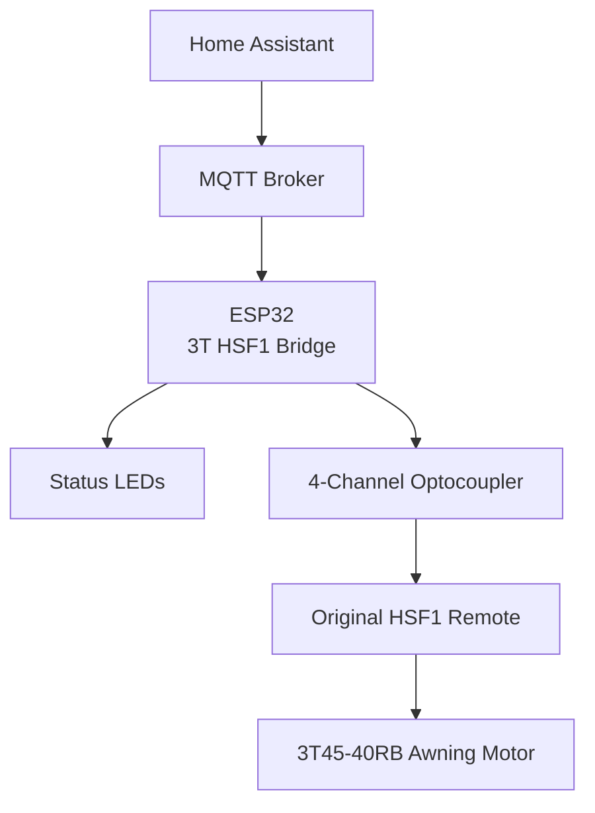

# System Overview

```mermaid
flowchart TD
    HA[Home Assistant]
    MQTT[MQTT Broker]
    ESP[ESP32<br/>3T HSF1 Bridge]
    LED[Status LEDs]
    OPTO[4-Channel Optocoupler]
    HSF1[Original HSF1 Remote]
    MOTOR[3T45-40RB Awning Motor]

    HA --> MQTT
    MQTT --> ESP
    ESP --> LED
    ESP --> OPTO
    OPTO --> HSF1
    HSF1 --> MOTOR
```
