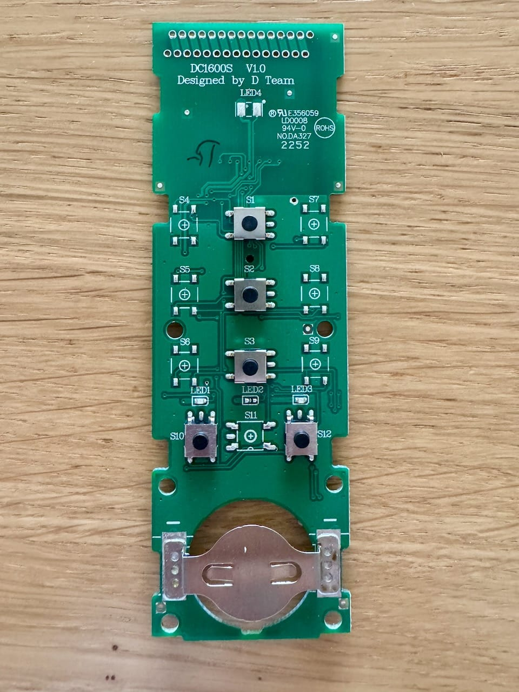

# 3T HSF1 Bridge

See the documentation in the `docs` folder.

ESP32-based Home Assistant bridge for controlling a 3T Components awning motor by electronically pressing the buttons of an original HSF1 remote.

## Why this project exists

Direct RF replay with a CC1101 was tested, but the 3T45-40RB motor did not react reliably even though the telegrams were decoded correctly by a sniffer.

This bridge therefore uses the original HSF1 remote as the radio transmitter. The ESP32 only simulates button presses via optocouplers.

## Hardware

- ESP32 LOLIN32
- Original 3T Components HSF1 remote
- 4-channel PC817 optocoupler module
- Status LEDs
- Resistors for LEDs
- USB power supply

## HSF1 button mapping

- S1 = Open / extend awning
- S2 = Stop / favorite position with long press
- S3 = Close / retract awning

## GPIO mapping

| GPIO | Function   |
| ---: | ---------- |
|   16 | Open / S1  |
|   17 | Stop / S2  |
|   18 | Close / S3 |
|   25 | WiFi LED   |
|   26 | MQTT LED   |
|   27 | Send LED   |
|   14 | Error LED  |

## Position model

The bridge estimates the awning position by runtime.

- 0% = fully retracted
- 100% = fully extended

Measured runtimes:

- Open / extend: 26.3 s
- Close / retract: 27.0 s

## Home Assistant entities

Planned:

- Cover: Markise
- WiFi status
- MQTT status
- Sending status
- WiFi signal
- Uptime
- Calibration buttons

## Safety note

This project does not connect to mains voltage or the awning motor directly. It only simulates button presses on the original battery-powered HSF1 remote.

## Architecture

- Configuration (`Config.h`)
- Pin assignments (`Pins.h`)

## Development status

Work in progress.

## Project Status

- ✅ Hardware reverse engineered
- ✅ HSF1 button contacts identified
- ⏳ ESP32 firmware
- ⏳ Home Assistant integration
- ⏳ Position tracking
- ⏳ Enclosure
